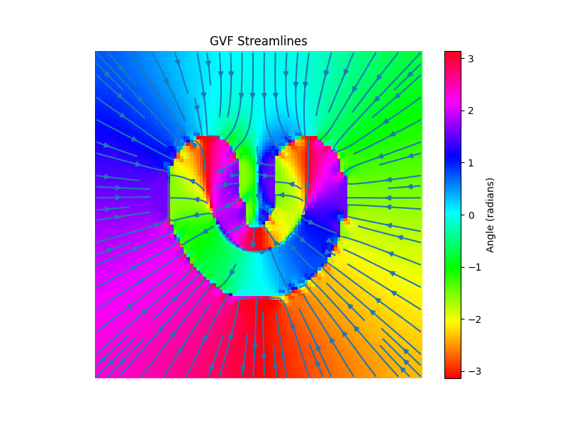

# GVF-Python, 2D only
Gradient Vector Flow in Python based on the work of [Chenyang Xu and Jerry Prince](http://www.iacl.ece.jhu.edu/static/gvf/).

Gradient Vector Flow in 3D based on the work of [Erik Smistad](https://www.eriksmistad.no/3d-gradient-vector-flow-matlab-implementation/)

If you search for a python version of the original gradient vector flow, this is it.

The base version of the repo still uses the MATLAB indexing and did not produce a correct result for me.

## Changes
- I only tested the 2D version and therefore removed 3D.
- Added a convergence check
- Added an example of the original U shape picture
- Added some tests

## Example: U-Shape
### Original U-Shape

Scaled down to 100x100. Larger images lead to issues.
### Streamlines
Color is the angle of the streamline

